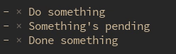
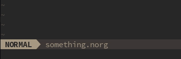
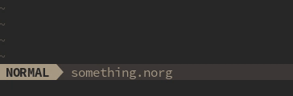
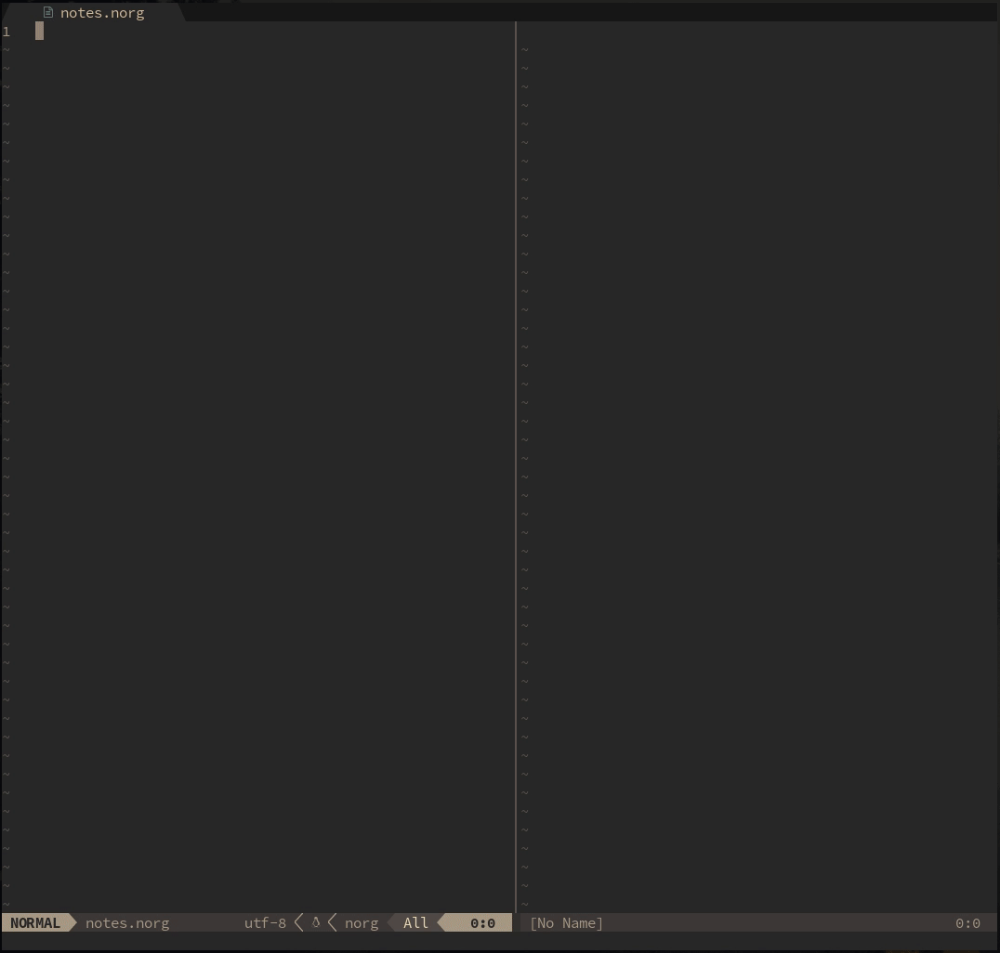
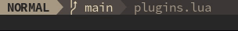

<div align="center">


# Neorg - An Organized Future

<a href="https://github.com/neovim/neovim">  </a>
<a href="https://discord.gg/T6EgTAX7ht">  </a>
<a href="https://paypal.me/ewaczupryna?locale.x=en_GB">  </a>
<a href="https://www.buymeacoffee.com/vhyrro">  </a>
<a href="https://patreon.com/vhyrro">  </a>

<a href="/LICENSE">  </a>
<a href="#wip">  </a>

---

Life Organization Tool Written in Lua

[Introduction](#star2-introduction)
•
[Installation](#wrench-installation)
•
[Usage](#question-usage)
•
[Keybinds](#keyboard-keybinds)
•
[Wiki](#notebook-consult-the-wiki)

[Credits: Logo by Binx](#green_heart-credits)

</div>

---

> The pain... it won't stop. After so much oppression from other text editors, it's time we fight back.
With the introduction of lua, we *will* fight back.

<div align="center">

---

### Manage Your Life with Neovim-inspired Keybinds
Woah, keybinds that actually make sense. Some text editors should take notes.



---

### Jump To The Most Important Directories with Workspaces
Teleport to your favourite locations right away.


</div>

<div align="center">


</div>

---

<div align="center">

### Configure Everything - Literally
Experience the power and configurability of Neorg's backend through modules and events.
<br>
Select only the code you want - throw everything else away.


</div>

---

<div align="center">

### TreeSitter Powered Editing
Feel more accurate edits thanks to Neorg's deeper understanding of your documents with Treesitter

(CURRENTLY WIP)



</div>

# :star2: Introduction
Neorg is a tool designed to reimagine organization as you know it. *Neo* - new, *org* - organization.
Grab some coffee, start writing some notes, let your editor handle the rest.

**Why do we need Neorg**? There are currently projects designed to [clone org-mode from emacs](https://github.com/kristijanhusak/orgmode.nvim),
what is the goal of this project? Whilst those projects are amazing, it's simply not enough. We need our _own, better_ solution - one that will
surpass _every_ other text editor. One that will give you all the bragging rights for using Neovim. Here's how we'll do it:
- Revise the org format - Simple, very extensible, unambiguous. Will make you feel right at home. Let's be real here, org and markdown have several flaws - ambiguity (tons of it), ugly syntax and the requirement for **complex parsers**.
  It's difficult to explain without doing some research, and I really advise educating yourself on just how bad
  markdown can get - I swear, it's worse than JS. What if we told you it's possible to eliminate those problems completely,
  all whilst keeping that familiar markdown feel? Enter the .norg file format, whose base spec is [almost complete](docs/NFF-0.1-spec.md).
  The cross between all the best things from org and the best things from markdown, revised and merged into one.
- Keybinds that _make sense_ - vim's keybind philosophy is unlike any other, and we want to keep that vibe.
  Keys form a "language", one that you can speak, not one that you need to remember.
- Infinite extensibility - no, that isn't a hyperbole. We mean it. Neorg is built upon an insanely modular and
  configurable backend - keep what you need, throw away what you don't care about. Use the defaults or change 'em.
  You are in control of what code runs and what code doesn't run.
- Logic. Everything has a reason, everything has logical meaning. If there's a feature, it's there because it's necessary, not because
  two people asked for it.

# :wrench: Installation
Installation may seem a bit daunting, however it's nothing you can't understand. If you really like to be in control,
you can read exactly what the below code snippets do in the [wiki](https://github.com/vhyrro/neorg/wiki/Installation).

- [Packer](https://github.com/wbthomason/packer.nvim):
  ```lua
  use {
      "vhyrro/neorg",
      config = function()
          require('neorg').setup {
              -- Tell Neorg what modules to load
              load = {
                  ["core.defaults"] = {}, -- Load all the default modules
                  ["core.norg.concealer"] = {}, -- Allows for use of icons
                  ["core.norg.dirman"] = { -- Manage your directories with Neorg
                      config = {
                          workspaces = {
                              my_workspace = "~/neorg"
                          }
                      }
                  }
              },
          }
      end,
  }
  ```
  Afterwards resource the current file and `:PackerSync`:

  


Worried about lazy loading? It's very hard to do properly because of the way Neovim handles filetypes. I'm planning on adding a PR with support
for Neorg files. Neorg practically lazy loads itself - it only runs when it detects a .norg extension.
You shouldn't get any real startup time hits.

##### :robot: For the latest and greatest check out the [unstable](https://github.com/vhyrro/neorg/tree/unstable) branch

### Setting up TreeSitter
As of right now, the TreeSitter parser is in its early stage. To install it, you want to run this code snippet before you invoke
`require('nvim-treesitter.configs').setup()`:

```lua
local parser_configs = require('nvim-treesitter.parsers').get_parser_configs()

parser_configs.norg = {
    install_info = {
        url = "https://github.com/vhyrro/tree-sitter-norg",
        files = { "src/parser.c" },
        branch = "main"
    },
}
```
Having a rare occurence where the parser doesn't work instantly? Try running `:e`.
You'll only need to run it once in your lifetime, for some reason TS doesn't have issues after that.

# :question: Usage
Simply drop into a .norg file and start typing!


You may realize that we don't have an insane amount of frontend features just yet.
This doesn't mean the plugin isn't capable of those things, it just means we're working on them!
We tried focusing heavily on the backend first, but now that that is almost done we are actually starting work on features just for you:
- [ ] Telescope.nvim integration for several things
- [x] Support for .norg filetype detection from any part of the filesystem
- [x] TreeSitter parser (can be found [here](https://github.com/vhyrro/tree-sitter-norg))
	- [x] AST Generation
	- [x] Custom highlight support
	- [ ] Indentation engine based on the treesitter parser
	- [ ] Smarter todo item toggling with the TreeSitter AST
- [ ] nvim-compe completion source (almost complete)

Everything you see above will be coming soon! Here's the things we do currently support:
- Indentation (a tad too predictive, will be fixed with TreeSitter)
- Toggling of TODO items with keybinds
- Very configurable workspaces

It's all about the patience! We're gonna deliver all the juicy features ASAP.
In the meantime you might be interested in reading the [spec](docs/NFF-0.1-spec.md) and familiarizing yourself with the new format :D

# :keyboard: Keybinds
Neorg comes with no keys bound by default. If you want to use all the default keys, you may want to modify the `core.keybinds`'s configuration
to generate them for you, here's how you would do it (note that this code snippet is an extension of the [installation](#wrench-installation) snippet):
```lua
use {
    "vhyrro/neorg",
    config = function()
        require('neorg').setup {
            -- Tell Neorg what modules to load
            load = {
                ["core.defaults"] = {}, -- Load all the default modules
                ["core.keybinds"] = { -- Configure core.keybinds
                    config = {
                        default_keybinds = true, -- Generate the default keybinds
                        neorg_leader = "<Leader>o" -- This is the default if unspecified
                    }
                },
                ["core.norg.concealer"] = {}, -- Allows for use of icons
                ["core.norg.dirman"] = { -- Manage your directories with Neorg
                    config = {
                        workspaces = {
                            my_workspace = "~/neorg"
                        }
                    }
                }
            },
        }
    end,
}
```

You may actually want to change your keybinds though! Changing keybinds is a rather trivial task.
The wiki entry for keybinds can be found [here](https://github.com/vhyrro/neorg/wiki/User-Keybinds). It'll tell you the ins and outs of what you need to do :)

# :notebook: Consult The Wiki
The wiki is the go-to place if you need answers to anything Neorg-related. Usage, Keybinds, User Callbacks, Modules, Events?
It's all there, so we recommend you seriously go [read it](https://github.com/vhyrro/neorg/wiki)!

# :computer: Contributing
Contributions are always welcome and will always be welcome. You can check [CONTRIBUTING.md](docs/CONTRIBUTING.md) if you wanna find out more.
Have a cool idea? Want to implement something, but don't know where to start? I'm always here to help! You can always create an issue or join the discord
and chat there.

# :purple_heart: Support
Love what I do? Want to see more get done faster? Want to support future projects of mine? Any sort of support is always
heartwarming and fuels the urge to keep going :heart:. You can support me here:
- [Buy me a coffee!](https://buymeacoffee.com/vhyrro)
- [Support on LiberaPay](https://liberapay.com/vhyrro)
- [Donate directly via paypal](https://paypal.me/ewaczupryna?locale.x=en_GB)
- [Support me on Patreon](https://patreon.com/vhyrro)

# :green_heart: Credits
Massive shoutouts to the people who supported the project! These are:
- Binx, for making that gorgeous logo for free!
	- [Github](https://github.com/Binx-Codes/)
	- [Reddit](https://www.reddit.com/u/binxatmachine)
- bandithedoge, for recreating the logo in svg form!
	- [Website](https://bandithedoge.com)
	- [Github](https://github.com/bandithedoge)
	- [YouTube](https://youtube.com/bandithedoge)
